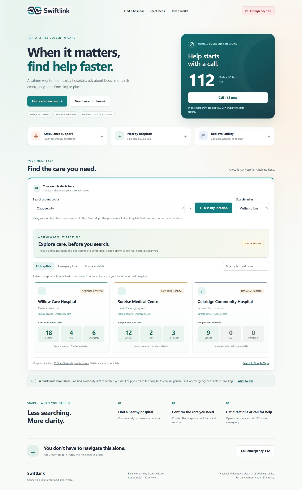
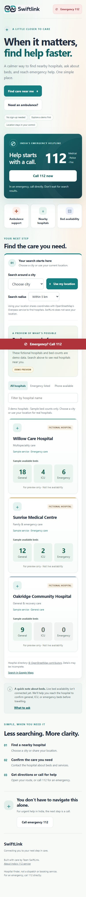

# SwiftLink

**A little closer to care.** A fast, comforting emergency-aid website built for patients and the people helping them.

**[Repository](https://github.com/geriayug30-png/SwiftLink-demo)**

**[Live website](https://geriayug30-png.github.io/SwiftLink-demo/)** · **[Staff dashboard](https://geriayug30-png.github.io/SwiftLink-demo/staff.html)** · **[Request care](https://geriayug30-png.github.io/SwiftLink-demo/request.html)**

## Hospital staff and shared requests

The matching staff dashboard now connects to Supabase for assigned staff sign-in, general/ICU/emergency bed counts, ready ambulances, incoming requests, capacity holds, dispatch confirmations, expected arrivals, and activity history. Patients can send requests to participating hospitals and track staff responses on the request page. Shree Hospital, Mumbai is configured with zero, unverified capacity until its staff confirms actual counts. Staff membership is managed privately in the backend, not in this public repository.

**Remaining setup: custom SMTP.** New account registration is disabled until email delivery is configured and tested, then `emailDeliveryReady` is set to `true` in `backend-config.js`. Existing verified accounts can sign in. Keep email verification enabled. See [backend setup and operations](BACKEND.md) for onboarding more hospitals and staff.

Database integration checks passed in PostgreSQL with rolled-back fixtures: staff permissions, private request access, verified-email requirements, capacity limits, repeated acceptance, expiration, dispatch, arrival and stale edits. Browser tests with mocked SDK responses passed for staff controls, patient requests/cancellation, authorization and connection failure states, sign-out privacy, and 1440px/390px/320px layouts. End-to-end email delivery remains unverified until SMTP setup.

## Project Overview

SwiftLink brings three urgent tasks into one simple screen: reaching India's emergency helpline **112**, finding nearby hospitals, and contacting hospitals to check whether the required bed and services are available. The supplied SwiftLink logo is preserved unchanged, with a calming teal-and-navy design.

**Directory listings remain unverified. Participating hospitals report capacity and manually accept requests through their staff dashboard. SwiftLink is not an emergency dispatch service and does not track ambulances. In an emergency, call 112 directly.**

## Setup & Installation Instructions

The static frontend has no build process. Hospital search needs no API key. Staff sign-in and shared requests require the Supabase backend described above; the SDK loads from jsDelivr.

1. Download this repository using **Code → Download ZIP**, then extract it (or clone it).
2. Open **index.html** in a modern browser.
3. Explore three fictional demo hospitals with sample general, ICU, and emergency bed counts immediately. Select a city or use your location to replace the demo with real directory results. For the most reliable location permissions and API access, use a hosted HTTPS site or a local server.

Optional local server, if Python is already installed:

```bash
git clone https://github.com/geriayug30-png/SwiftLink-demo.git
cd SwiftLink-demo
python -m http.server 8000
```

Open `http://localhost:8000`. You can also use your editor's Live Server extension.

### GitHub Pages

In the repository's **Settings → Pages**, choose **Deploy from a branch**, select **main** and **/ (root)**, then save. No build configuration is required.

## Key Features

- Prominent one-tap **112** call links and a persistent emergency bar on mobile.
- Ambulance assistance panel with concise information to share with the emergency operator.
- Nearby hospital search using device location or ten Indian city presets.
- Search radii of 5, 10, and 20 km, with nearest-first results and straight-line distances.
- Filters for hospital name, listed emergency service, and available phone numbers.
- Hospital contact links, Google Maps directions, and a bed-enquiry checklist.
- Three clearly labelled fictional demo hospitals with sample bed counts before searching; no location request or network query on page load.
- Real hospital results retain **availability not verified** labels. Demo cards never offer calls, directions, or booking.
- Soft background gradients, colour-accented hospital cards, and readable bed-count tiles on desktop and mobile.
- Accessible labels, keyboard navigation, dialog focus handling, reduced-motion support, and responsive layouts.
- Loading, empty, permission-denied, timeout, and network-error states with a Maps fallback.
- Five-minute in-memory hospital-query caching. The finder does not store device location. The separate request workflow stores callback numbers and supplied pickup landmarks with explicit consent.

## Technology Stack

| Layer | Technology |
| --- | --- |
| Structure | Semantic HTML5 |
| Design | CSS3, Grid, Flexbox, responsive media queries |
| Interactions | Plain JavaScript, Fetch, native dialog |
| Location | Browser Geolocation API |
| Hospital directory | OpenStreetMap via Overpass API |
| Directions | Google Maps URL links |
| Hosting | Any static web host, including GitHub Pages |
| Staff and requests | Supabase Auth, PostgreSQL and restricted database functions |

## Architecture / Workflow

```text
index.html       Page structure and emergency actions
styles.css       Responsive teal-and-navy design
app.js           Location, directory search, filters, and dialogs
assets/
  swiftlink-logo.png   Original supplied logo
README.md        Project documentation
```

1. The visitor sees fictional demo hospitals, then selects a city or explicitly requests device location. Name and emergency filters also work on demo cards; phone filtering explains that demo hospitals have no real phone numbers.
2. Demo cards are removed and JavaScript sends a bounded hospital query to Overpass. Clearing the city selection restores the preview; failed real searches show an error rather than sample availability.
3. Results are normalized, duplicate entries removed, and distances calculated locally.
4. The visitor filters results, calls a listed number, or opens directions.
5. Bed availability is confirmed directly with the hospital; SwiftLink makes no reservation.

The hospital finder runs in the browser without login. Staff and patient requests use verified Supabase accounts and server-side database functions. External text is inserted with `textContent`, and telephone values are validated before creating call links. Superseded directory requests are cancelled so older search responses cannot replace newer results.

## Dataset / API Information

- **Hospital data:** [OpenStreetMap contributors](https://www.openstreetmap.org/copyright), provided under the Open Database License, queried through the [Overpass API](https://wiki.openstreetmap.org/wiki/Overpass_API). Endpoint: `https://overpass-api.de/api/interpreter`.
- Queries retrieve nearby objects tagged `amenity=hospital` or `healthcare=hospital`; data can include hospital names, coordinates, addresses, phone numbers, and emergency-service tags.
- Phone numbers and emergency tags are community-maintained directory entries, not independently verified service guarantees. Missing information is shown honestly.
- **OpenStreetMap does not supply live availability.** Participating hospitals maintain separate staff-confirmed counts through the connected backend; unverified or stale reports are labelled accordingly. Total capacity is never presented as currently available beds.
- City coordinates are fixed search centres, not the visitor's location. Device coordinates are requested only after tapping **Use my location**, then sent to Overpass. They remain in memory and are not saved by SwiftLink.
- Google Maps links open an external service, which receives the search or destination. Read the providers' own privacy policies before using them.
- The public Overpass endpoint is a shared service and may be slow, rate-limited, unavailable, or blocked by a browser/network. Requests are user-triggered, bounded, cached in memory for five minutes, and time out after 25 seconds. Production-scale use should use a suitable hosted or self-managed provider.
- The [Government of India's 112 service](https://112.gov.in/) is the source for the emergency number. SwiftLink is an independent project, not an official government or hospital service.

## Screenshots / Demo Information

Open `index.html` directly, or enable GitHub Pages using the instructions above.



<details>
<summary>Mobile screenshot</summary>



</details>

The demo update was checked in Chromium at 1440px, 390px, and 320px widths. Automated browser checks covered initial demo counts, no initial network/geolocation request, name/emergency/phone filters, location success and denial, city search, directory failure, restoring the demo, and the bed-enquiry dialog. Geolocation and directory responses were mocked for repeatable checks; live provider availability was not tested. JavaScript syntax and whitespace checks passed. No emergency calls were placed during testing.

Suggested walkthrough:

1. Browse the fictional demo hospitals and sample bed counts, then open the ambulance panel without placing a call.
2. Select Mumbai, or use a location with permission.
3. Try hospital-name and contact filters, then change the search radius.
4. Open **Ask about beds** and review the confirmation checklist.
5. Open directions to a selected hospital.
6. Check the layout on a phone. Do **not** call emergency services for testing.

## Limitations & Future Scope

- No automatic inventory feed, vehicle tracking, emergency dispatch integration, or patient triage. Availability and estimated arrivals are manually confirmed by hospital staff.
- Hospital listings may omit facilities or contain outdated details. Call to confirm services and availability.
- Distances are straight-line estimates, not driving distances or travel times.
- The city selector searches around a city centre; device location provides a more relevant starting point.
- Internet is needed for hospital searches and maps. The page and 112 links remain usable without a successful directory response, but placing a call requires a supported device and telephone service.
- Location permission depends on browser support and secure contexts; use HTTPS or localhost for reliable behaviour.
- The initial directory displays up to 30 nearest matches to keep the page quick.
- Future work: verified hospital partnerships, automated bed feeds, confirmed emergency-dispatch integration, multilingual access, and provider monitoring.

## Team Members

| Name | Role |
| --- | --- |
| **Shree Gawde** | **Leader** |
| Bhumika Dubey | Team Member |
| Yug Geria | Team Member |
| Jay Dama | Team Member |
